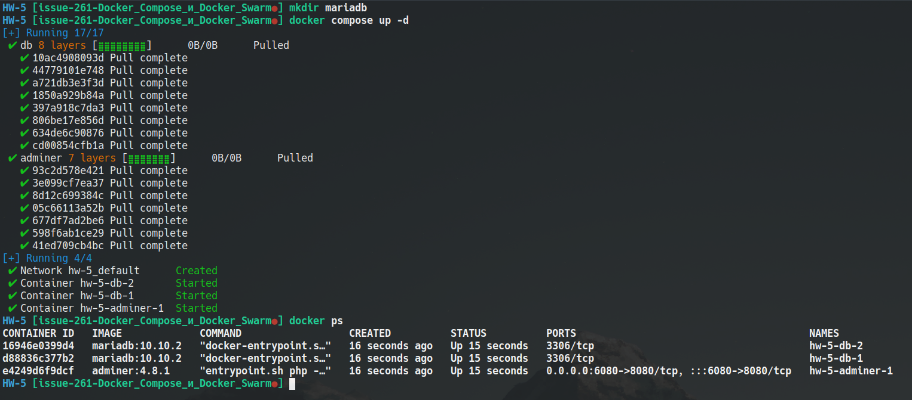

# Урок 5. Docker Compose и Docker Swarm

## Задание 1:
1) создать docker compose файл, состоящий из 2 различных контейнеров: 1 - веб, 2 - БД

```sh
mkdir mariadb
```

```yaml
version: '3.8'

services:

  db:
    image: mariadb:10.10.2
    environment:
      MYSQL_ROOT_PASSWORD: GB
    volumes:
      - /home/sasha/develop/GeekBrains/Containerization/HW-5/mariadb:/var/lib/mariadb
    deploy:
      mode: replicated
      replicas: 2

  adminer:
    image: adminer:4.8.1
    restart: always
    ports:
      - 6080:8080
    volumes:
      - /home/salerat/dumps:/dumps
    deploy:
      mode: replicated
      replicas: 1
```

2) запустить docker compose файл

```sh
docker compose up -d
```

3) по итогу на БД контейнере должно быть 2 реплики, на админере должна быть 1 реплика. Всего должно получиться 3 контейнера

```sh
docker ps
```


4) выводы зафиксировать




